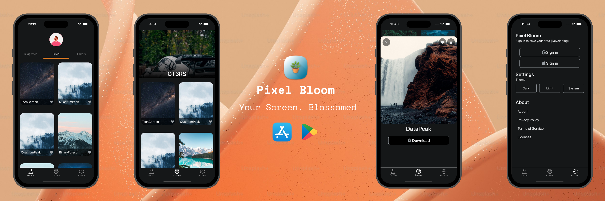

# 🌸 Pixel Bloom

**Pixel Bloom** gives your phone a fresh and vibrant look! Explore a stunning collection of HD and 4K wallpapers, ranging from breathtaking landscapes to sleek minimalistic designs. Elevate your screen with Pixel Bloom! 📱✨

---

## 📑 Table of Contents

1. [Overview](#-overview)
2. [Technologies](#-technologies)
3. [Packages & Libraries Used](#-packages--libraries-used)
4. [Getting Started](#-getting-started)
5. [Setup](#-setup)
6. [Features](#-features)
7. [Demo & Screenshots](#-demo--screenshots)
8. [Acknowledgments](#-acknowledgments)
9. [License](#-license)

---

## 🌟 Overview

**Description**:  
Pixel Bloom offers a vibrant gallery of wallpapers for every mood and style. Whether you love scenic landscapes, abstract art, or minimalist designs, Pixel Bloom has you covered.

---

## 💻 Technologies

This project leverages the following technologies:

| Mobile Framework        | Language       |
| ----------------------- | -------------- |
| **React Native + Expo** | **TypeScript** |

---

## 📦 Packages / Libraries Used

The following packages and libraries are used in this project:

| Package / Library          | Purpose                             |
| -------------------------- | ----------------------------------- |
| `React Native Bottomsheet` | Smooth and responsive bottom sheets |
| `React Native Carousel`    | Display carousel for wallpapers     |

---

## 🚀 Getting Started

Follow the official React Native setup guide for your platform:  
**[React Native Setup Guide](https://reactnative.dev/docs/environment-setup)**

---

## ⚙️ Setup

1. Run the following command to start the application:
   ```bash
   npm start
   ```
2. Follow the on-screen instructions to launch the application on your device or emulator.

---

## 🎯 Features

1. **Wallpaper Display**: Browse a collection of high-resolution HD and 4K wallpapers.
2. **Download Wallpapers**: Save your favorite wallpapers directly to your device.
3. **Adaptive Icons**: Icons adjust seamlessly for Light Mode, Dark Mode, and Material You themes.

---

## 🔗 Demo & Screenshots



- [Download Now]()

---

## 🙏 Acknowledgments

Special thanks to:

- [YouTube Tutorial](https://youtu.be/NQi1CdGo6dU?si=H5yiOUt29M6cTAZ8) for inspiration and guidance.

---

## 📜 License

This project is licensed under the [MIT License](LICENSE). See the [LICENSE](LICENSE) file for details.

---

### 🌸 Beautify your phone with **Pixel Bloom** today!
